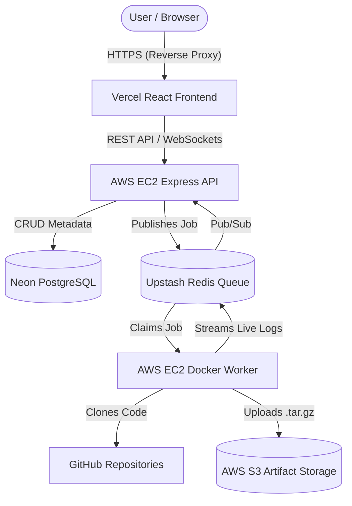

# 🚀 CloudBuildX


> A highly scalable, distributed Continuous Integration and Continuous Deployment (CI/CD) engine built to securely clone, isolate, and execute GitHub repositories using Docker.

CloudBuildX is a custom-built infrastructure platform similar to GitHub Actions or Vercel. It features a fully decoupled architecture with a React frontend, an Express REST API, a Redis job queue, and a dedicated Docker-based Worker node that safely executes untrusted code in isolated container environments.

---

## ✨ Features

- **Isolated Execution:** Safely executes untrusted user code inside ephemeral Docker containers.
- **Distributed Architecture:** API and Worker servers are decoupled using a BullMQ Redis message broker, allowing infinite horizontal scaling of worker nodes.
- **Real-Time Log Streaming:** Streams raw Docker execution logs directly to the browser in real-time using WebSockets.
- **Artifact Management:** Automatically compresses successful build directories into `.tar.gz` files and uploads them to an AWS S3 bucket for permanent storage.
- **Infrastructure as Code:** Uses a `build.yml` configuration file in the target repository to determine the build environment and execution commands.

---

## 🏗️ System Architecture



---

## 🛠️ Tech Stack

- **Frontend:** React, TypeScript, TailwindCSS, Socket.io-client, Vite
- **Backend API:** Node.js, Express, TypeScript, Prisma ORM, Socket.io
- **Worker Engine:** Node.js, Docker API (dockerode), BullMQ, AWS SDK
- **Database:** Neon (Serverless PostgreSQL)
- **Message Broker:** Upstash (Serverless Redis)
- **Storage:** Amazon Web Services (AWS S3)
- **Deployment:** Vercel (UI), Amazon EC2 (Backend & Docker Engine)

---

## 🧪 Testing the Live Demo

To test the CI/CD pipeline live on the internet:

1. Visit the deployed application: **[CloudBuildX Live Demo](https://cloud-build-gxh6kcxc8-abhi-nsuts-projects.vercel.app/)**
2. Create an account and log in.
3. Paste the URL of my test repository: `https://github.com/Abhi-NSUT/cloudbuildx-demo`
4. On the dashboard, click **"Queue Build"**.
5. Watch the architecture dynamically provision a Docker container, execute the tests, and stream the logs live to your browser!

---

## 💻 Local Development Setup

To run CloudBuildX locally, you need [Docker Desktop](https://www.docker.com/products/docker-desktop/) installed.

### 1. Clone the repository
```bash
git clone https://github.com/[YOUR-GITHUB-USERNAME]/cloudBuildX.git
cd cloudBuildX
```

### 2. Environment Variables
Copy the `.env.example` file to `.env` and fill in your database credentials:
```bash
cp .env.example .env
```

### 3. Start the Infrastructure (Database, Redis, MinIO)
We use Docker Compose to spin up local mocks of PostgreSQL, Redis, and AWS S3 (MinIO).
```bash
docker-compose up -d
```

### 4. Start the API
```bash
npm install
npx prisma db push
npm run dev
```

### 5. Start the Worker (In a new terminal)
```bash
cd worker
npm install
npm run dev
```

### 6. Start the Frontend (In a new terminal)
```bash
cd ui
npm install
npm run dev
```

---

## 📸 Screenshots

*(Add screenshots of your Dashboard, the live Terminal streaming logs, and the Create Build page here!)*

---

## 🐛 Known Issues & Future Improvements
- **GitHub Webhooks:** Implement GitHub App webhooks to automatically trigger builds when code is pushed to the `main` branch.
- **GitHub OAuth:** Replace JWT email authentication with direct GitHub OAuth integration.

---

*Designed and engineered by [Abhijeet].*